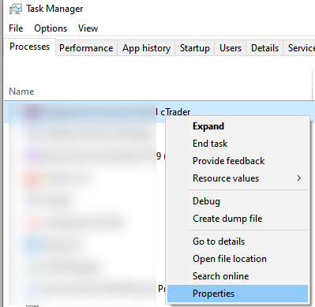
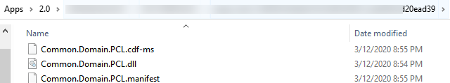
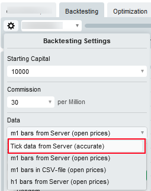

# cTrader OpenData Conversion

## Why

Quants is hard to find an easy way to analysis data in R / Python. This package means to make Quants' life more easier.


## Getting started

1. Run ctrader

2. Open TaskManager to locate the path of ctrader.


3. Identify following .net library which required to run this OpenData Data Conversion program.

```bash
Common.Domain.dll
Common.Domain.PCL.dll
ctrader.Automate.Small.V1.dll
ctrader.Automate.Small.V1.Backtesting.dll
Core.Framework.Extension.PCL.dll
```
4. Add all **5** libraries to the project.

5. Download Historial Tick Record from server, and ensure you've selected **Tick data from Server** option.



6. Once the historial tick data downloaded into your computer, find the Backtest Cache directory.
```batch
%USERPROFILE%\AppData\Roaming\xxxxxxxx cTrader\BacktestingCache
```

7. Modify the **account id** to your account id, then compile and run the application.
```csharp
    var _account = "<<account id>>";
    var _start = new DateTime(2013, 7, 22);
    var _end = new DateTime(2020, 4,30);

```

## License

cTrader OpenData is licensed under the [MIT license](./doc//LICENSE).


## Contributing

Feel free to throw your idea on new integration, features, and contribution to this repo.
